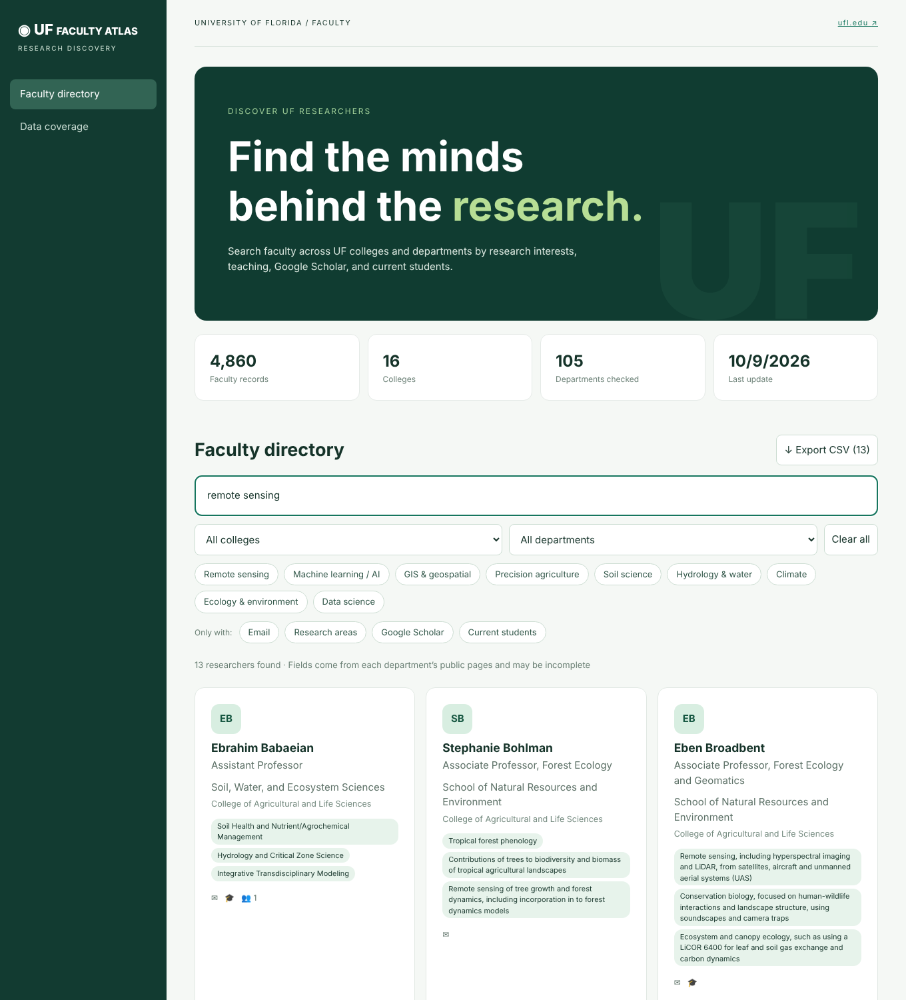

# UF Faculty Atlas

Search University of Florida faculty by college, department, research interests, teaching, Google Scholar and current students. Independent project built from public UF web pages — **not an official UF product**.



**Live app:** https://nikhilrajdeep.github.io/UF-Faculty-Atlas/

## What you get

* Search 4,800+ UF faculty by name, research interest, course, lab, student or department.
* Filter by college and department, or by topic (remote sensing, machine learning, soil science and more).
* Show only people who have an email, listed research areas, a Google Scholar link or current students.
* Open a faculty card for the full profile and export the current results as CSV.
* A *Data coverage* tab shows, for every department, whether its faculty list was found.

## How it works

```
GitHub Actions (refresh.yml)                          GitHub Pages (docs/ on main)
  reads gradcatalog.ufl.edu  ─►  colleges + departments     docs/index.html + assets   (the app)
  opens each department site ─►  faculty list, students     docs/data/*.json            (the database)
  opens each faculty profile ─►  email, research, teaching,
                                 Scholar, extension, lab
  commits docs/data/*.json   ────────────────────────────►  app loads these files directly
```

* **The database is in this repository**: `docs/data/faculty.json`, `coverage.json`, `meta.json`. The app reads those files; nothing else.
* **Coverage is reported honestly**: the *Data coverage* tab lists every department and whether its faculty list was found. Departments whose site layout isn't recognised fall back to the graduate catalog roster (name, rank, department).
* Student **e-mails and home locations are not collected**; only name, program and advisor as published by the department.

## Automatic updates

The database refreshes itself about **every four months**. A workflow wakes up monthly and runs the crawl only when the last update is at least 110 days old; in other months it just makes a tiny keep-alive commit so GitHub doesn't pause the schedule. To refresh immediately: Actions → *Refresh UF faculty database* → Run workflow.

## Built with

* **Data collection:** Python (requests, BeautifulSoup, lxml) running on GitHub Actions.
* **App:** React and Vite, served as a static site by GitHub Pages — no server or database service.
* **Built with AI assistance:** the crawler and the web app were developed with [Claude](https://claude.ai) (Anthropic), using Claude Code, under my direction and review.

## Files

| Path | Purpose |
|---|---|
| `src/` | React app (faculty directory, data coverage) |
| `docs/` | Built app + database served by GitHub Pages |
| `scripts/atlas/` | Crawler: `crawl.py` (pipeline), `parsers.py` (HTML parsing), `clean.py` (cleanup and de-duplication), `fetch.py` (polite fetching, robots.txt) |
| `scripts/validate.py` | Refuses to commit a bad run |

## Data and privacy

All information comes from public UF web pages and is shown as published, so it can be incomplete or out of date. Student e-mails and home locations are never collected. If you would like a record corrected or removed, please open an issue.

## Notes on responsible scraping

The crawler identifies itself, honours `robots.txt` and crawl delays, waits at least one second between requests to the same host, and only reads pages on `*.ufl.edu`. If UF's rules change, adjust `scripts/atlas/fetch.py`.
